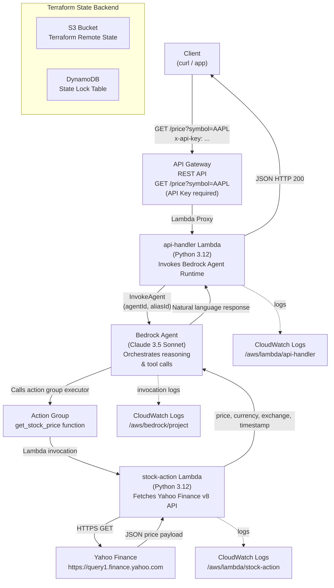

# AI Stock Price Agent — AWS Bedrock + Terraform

A production-ready, serverless infrastructure that exposes a REST API endpoint for real-time stock price lookups. The API is backed by an **AWS Bedrock Agent** (Claude 3.5 Sonnet) that uses a **Lambda action group** to fetch live quotes from Yahoo Finance. All infrastructure is provisioned with **Terraform** and deployed via a **GitHub Actions CI/CD pipeline**.

---

## Architecture



---

## Project Structure

```
ai-project/
├── lambda/
│   ├── stock_action/
│   │   └── handler.py          # Bedrock action group — Yahoo Finance fetcher
│   └── api_handler/
│       └── handler.py          # API Gateway handler — Bedrock Agent invoker
├── terraform/
│   ├── main.tf                 # Root module — orchestrates all child modules
│   ├── variables.tf            # Input variables with sensible defaults
│   ├── outputs.tf              # Exported values (endpoint, agent IDs, key ID)
│   ├── provider.tf             # AWS provider + S3/DynamoDB remote state backend
│   └── modules/
│       ├── iam/                # IAM roles and policies for all components
│       ├── bedrock/            # Bedrock logging config, Agent, action group, alias
│       ├── lambda/             # Reusable Lambda module (auto-zips source)
│       └── apigateway/         # REST API, usage plan, API key, deployment
└── .github/
    └── workflows/
        └── terraform.yml       # CI/CD pipeline (fmt → validate → plan → apply → smoke test)
```

---

## Request Flow (Step by Step)

| Step | Component | Action |
|------|-----------|--------|
| 1 | **Client** | Sends `GET /price?symbol=AAPL` with `x-api-key` header |
| 2 | **API Gateway** | Validates API key against usage plan; forwards request via Lambda proxy |
| 3 | **api-handler Lambda** | Validates and sanitises the `symbol` parameter; calls `bedrock-agent-runtime:InvokeAgent` |
| 4 | **Bedrock Agent (Claude)** | Interprets the prompt, decides to call `get_stock_price("AAPL")` via action group |
| 5 | **stock-action Lambda** | Fetches `https://query1.finance.yahoo.com/v8/finance/chart/AAPL` and extracts `regularMarketPrice`, currency, exchange, and timestamp |
| 6 | **Bedrock Agent** | Receives the structured payload, composes a natural language reply |
| 7 | **api-handler Lambda** | Streams the agent completion, wraps it in a JSON body `{"symbol": ..., "response": ...}` |
| 8 | **Client** | Receives HTTP 200 with price data |

---

## Infrastructure Components

### IAM (`modules/iam`)

| Resource | Principal | Permissions |
|----------|-----------|-------------|
| `bedrock-role` | `bedrock.amazonaws.com` | InvokeModel, InvokeModelWithResponseStream, Agents, KnowledgeBases, CloudWatch Logs |
| `lambda-stock-role` | `lambda.amazonaws.com` | AWSLambdaBasicExecutionRole (CloudWatch Logs only) |
| `lambda-api-role` | `lambda.amazonaws.com` | AWSLambdaBasicExecutionRole + `bedrock:InvokeAgent` |

### Bedrock (`modules/bedrock`)

| Resource | Details |
|----------|---------|
| `aws_bedrock_model_invocation_logging_configuration` | Full logging — text, image, embedding delivery to CloudWatch |
| `aws_bedrockagent_agent` | Claude 3.5 Sonnet v2, idle TTL 300 s, `prepare_agent = true` |
| `aws_bedrockagent_agent_action_group` | `StockPriceActionGroup` with `get_stock_price(ticker: string)` function schema |
| `aws_lambda_permission` | Grants `bedrock.amazonaws.com` permission to invoke stock Lambda; scoped to agent ARN |
| `aws_bedrockagent_agent_alias` | Alias `live` — stable pointer consumed by api-handler Lambda |

### Lambda (`modules/lambda` — reusable)

The module is instantiated twice with different configuration:

| Instance | Suffix | Source | Execution Role | Environment Variables |
|----------|--------|--------|----------------|-----------------------|
| Stock action | `stock-action` | `lambda/stock_action/` | `lambda-stock-role` | — |
| API handler | `api-handler` | `lambda/api_handler/` | `lambda-api-role` | `BEDROCK_AGENT_ID`, `BEDROCK_AGENT_ALIAS_ID` |

Terraform's `archive_file` data source automatically zips the source directory on every `plan/apply` and detects code changes via `source_code_hash`.

### API Gateway (`modules/apigateway`)

| Resource | Configuration |
|----------|---------------|
| REST API | Regional endpoint |
| Resource | `/price` |
| Method | `GET` — `api_key_required = true` |
| Integration | `AWS_PROXY` → api-handler Lambda |
| Deployment/Stage | Recreates on config drift (sha1 trigger); stage `v1` |
| API Key | `{project_name}-stock-api-key` |
| Usage Plan | 10 rps rate limit, 20 burst |
| Lambda Permission | `source_arn` scoped to `*/*/GET/price` |

---

## Deployment

### Prerequisites

- Terraform ≥ 1.5.0
- AWS CLI configured with credentials that have the IAM/Lambda/Bedrock/API Gateway permissions
- S3 bucket `venktata-akula-tf-state-bucket-us-east-1` and DynamoDB table `terraform-state-lock` already created

### First Deploy

```bash
cd terraform
terraform init
terraform plan
terraform apply
```

### Get the API Key Value

```bash
aws apigateway get-api-key \
  --api-key $(terraform output -raw api_key_id) \
  --include-value \
  --query value \
  --output text
```

### Call the Endpoint

```bash
# Replace <KEY> with the value from the step above
curl -H "x-api-key: <KEY>" \
  "$(terraform output -raw api_endpoint)?symbol=AAPL"
```

Expected response:

```json
{
  "symbol": "AAPL",
  "response": "The current stock price for AAPL (Apple Inc.) is $172.45 USD on NASDAQ, as of 2026-04-27T18:32:00+00:00."
}
```

### Destroy

```bash
terraform destroy
```

---

## Configuration Variables

| Variable | Default | Description |
|----------|---------|-------------|
| `aws_region` | `us-east-1` | AWS region for all resources |
| `project_name` | `venkata-ai-project` | Prefix applied to every resource name |
| `bedrock_model_id` | `anthropic.claude-3-5-sonnet-20241022-v2:0` | Foundation model for the Bedrock Agent |
| `lambda_timeout` | `30` | Lambda timeout in seconds |
| `lambda_memory_size` | `256` | Lambda memory in MB |
| `log_retention_days` | `30` | CloudWatch log retention in days |
| `api_stage_name` | `v1` | API Gateway deployment stage name |

Override any variable via `-var` flag or a `terraform.tfvars` file:

```hcl
# terraform.tfvars
bedrock_model_id   = "anthropic.claude-3-5-haiku-20241022-v1:0"
lambda_memory_size = 512
log_retention_days = 7
```

---

## CI/CD Pipeline

The GitHub Actions workflow (`.github/workflows/terraform.yml`) runs on every push or PR touching `terraform/**` or `lambda/**`:

```
push / PR
    │
    ▼
┌─────────────────────┐
│  Init & Validate     │  terraform init
│                     │  terraform fmt -check -recursive
│                     │  terraform validate
└────────┬────────────┘
         │
         ▼
┌─────────────────────┐
│  Plan               │  terraform plan -out=tfplan
│                     │  uploads plan artifact
└────────┬────────────┘
         │  (main branch push or manual apply)
         ▼
┌─────────────────────┐
│  Apply              │  terraform apply tfplan
│                     │  ── Smoke Test ──────────────
│                     │  GET /price?symbol=AAPL
│                     │  asserts non-empty response
└─────────────────────┘
```

Required GitHub Secrets:

| Secret | Description |
|--------|-------------|
| `AWS_ACCESS_KEY_ID` | IAM access key for Terraform |
| `AWS_SECRET_ACCESS_KEY` | IAM secret key for Terraform |

---

## Security Notes

- API Gateway enforces an API key on every request; keys are bound to a usage plan with rate/burst throttling.
- Lambda resource-based policies use narrowly scoped `source_arn` to prevent confused-deputy attacks.
- The Bedrock Agent→Lambda permission is scoped to the specific agent ARN.
- The `lambda-stock-role` has no outbound AWS API permissions (CloudWatch Logs only); Yahoo Finance is reached over public HTTPS with a 10-second timeout.
- The `lambda-api-role` can only call `bedrock:InvokeAgent` — it cannot invoke models directly or manage agent resources.
- **Rotate the root AWS credentials** visible in `rootkey.csv` immediately and replace with a least-privilege IAM user or OIDC-based role for CI/CD.

---

## Outputs

After `terraform apply`:

| Output | Description |
|--------|-------------|
| `api_endpoint` | Full invoke URL — `https://<id>.execute-api.us-east-1.amazonaws.com/v1/price` |
| `api_key_id` | API key ID (retrieve secret value with AWS CLI — see above) |
| `bedrock_agent_id` | Bedrock Agent ID |
| `bedrock_agent_alias_id` | Agent alias ID (`live`) |
| `stock_lambda_name` | Name of the stock action Lambda |
| `api_lambda_name` | Name of the API handler Lambda |
| `bedrock_role_arn` | Bedrock execution role ARN |
| `bedrock_log_group` | CloudWatch log group for Bedrock invocations |
